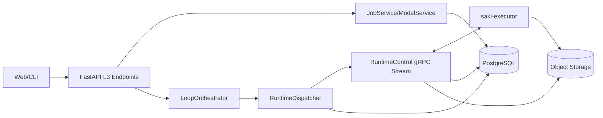

# Saki API Runtime 具体实现全流程解析（从创建 Loop 到结束）

> 版本基线：当前 `saki-api` 仓库实现（2026-02-12）
> 关注：真实代码路径、状态流转、参数链路、数据链路、日志与制品链路。

---

## 0. 组件拓扑（实现视角）

关键入口文件：
1. 应用启动：`saki-api/src/saki_api/main.py`
2. Loop/Job API：`saki-api/src/saki_api/api/api_v1/endpoints/l3/*.py`
3. 编排器：`saki-api/src/saki_api/services/runtime/loop_orchestrator.py`
4. 调度器：`saki-api/src/saki_api/grpc/dispatcher.py`
5. gRPC 控制面：`saki-api/src/saki_api/grpc/runtime_control.py`
6. 协议与编解码：`proto/runtime_control.proto` + `saki-api/src/saki_api/grpc/runtime_codec.py`

---

## 1. 从 AL Loop 创建到流程结束：逐步链路

## 1.1 创建 Loop（只是建模，不执行）

调用：`POST /api/v1/projects/{project_id}/loops`

代码：`api_v1/endpoints/l3/query.py -> create_project_loop -> JobService.create_loop`

行为：
1. 校验 branch 存在、归属一致。
2. 校验 plugin_id/model_arch 是否存在于 executor 能力目录。
3. 规范化配置：
   - `normalize_loop_global_config`
   - `merge_model_request_config`
   - simulation 配置补全（系统默认 + 请求覆盖）
4. 插入 `loop` 表，默认状态通常是 `DRAFT`。

写入对象：`ALLoop`（`models/runtime/loop.py`）

---

## 1.2 启动 Loop（进入 RUNNING）

调用：`POST /api/v1/loops/{loop_id}:start`

代码：`endpoints/l3/loop_control.py -> JobService.start_loop -> loop_orchestrator.tick_once`

行为：
1. Loop 状态置 `RUNNING`。
2. 立即触发一次 orchestrator tick（避免等待周期）。

---

## 1.3 Orchestrator Tick：决定是否建 Job、是否推进下一轮

代码：`LoopOrchestrator._tick`

步骤：
1. `LoopRepository.list_running_ids()` 取所有运行中 loop。
2. 对每个 loop 调 `_process_loop(loop_id)`。
3. 末尾调用 `runtime_dispatcher.dispatch_pending_tasks()`。

---

## 1.4 _process_loop：核心推进逻辑

代码：`LoopOrchestrator._process_loop`

分支：
1. 无 latest_job：创建下一轮 job/task。
2. latest_job 运行中：仅尝试派发可执行 task。
3. latest_job 终态：
   - 若失败/取消 -> loop 标记 `FAILED`
   - 若成功/部分失败 -> 按 mode policy 决定是否 next job 或 complete

---

## 1.5 创建 Job + Task 链

代码：`JobService.create_next_job_with_tasks`

关键逻辑：
1. `next_round = loop.current_iteration + 1`
2. 构造 job params（模型请求参数 + round/mode/query_strategy）
3. simulation 模式进入 `_resolve_simulation_round`：
   - 读取 `oracle_commit_id`
   - 计算 `total_count/current_ratio/selected_count/add_count`
   - 把 simulation 参数注入 task params
4. 创建 `job`（`summary_status=JOB_PENDING`）
5. 按 mode 生成 task 链（`TASK_SPECS_BY_MODE`）并写 `depends_on`
6. 更新 loop：`phase/current_iteration/last_job_id/phase_meta`

mode 对应 task 序列：
1. active_learning/manual：`TRAIN -> SCORE -> SELECT -> UPLOAD_ARTIFACT`
2. simulation：`TRAIN -> SCORE -> AUTO_LABEL -> EVAL`

---

## 1.6 任务入队与派发

入队：`LoopOrchestrator._create_next_job` 对无依赖 task 调 `runtime_dispatcher.enqueue_task(task.id)`

派发：
1. `dispatch_pending_tasks()` 消费内部队列；
2. `_assign_task_locked(task_id)` 执行分配。

分配细节（`grpc/dispatcher.py`）：
1. `_load_task_payload` 从 `job_task + job` 读取 payload。
2. `_pick_executor(plugin_id)` 选择可用 executor（在线、非 busy、插件匹配、allowlist）。
3. DB 更新：task -> `DISPATCHING`，job -> `JOB_RUNNING`。
4. 下发 `AssignTask`（通过 executor session queue）。
5. 记录 `_pending_assign[request_id]`，等待 ACK。

---

## 1.7 Executor ACK 与状态变化

入口：`RuntimeControlService._handle_message` 收到 `ack` -> `runtime_dispatcher.handle_ack`

`ACK_TYPE_ASSIGN_TASK`：
1. `OK` -> `_mark_task_running`（task `RUNNING`，job `JOB_RUNNING`）
2. `ERROR` -> `_reset_task_to_pending` + 重新入队

超时恢复：
- `_cleanup_stale_assignments` 按 `RUNTIME_ASSIGN_ACK_TIMEOUT_SEC` 检测超时，task 回 `PENDING` 并重新 `enqueue_task`。

---

## 1.8 运行中事件上报（日志/状态/进度/指标/制品）

入口：`RuntimeControlService._persist_task_event`

事件类型：
1. status
2. log
3. progress
4. metric
5. artifact

落库：
1. `task_event`（去重键：`task_id + seq`）
2. metric 事件追加 `task_metric_point`
3. artifact 事件增量合并到 `job_task.artifacts`
4. status 事件同步更新 `job_task.status`
5. 每次事件后 `_recompute_job_summary`

---

## 1.9 任务结果回传

入口：`RuntimeControlService._persist_task_result`

行为：
1. 更新 task 终态、metrics、artifacts、last_error、started_at/ended_at。
2. 清空并重写 `task_candidate_item`（按 rank 存储）。
3. 把 task.metrics 作为 step=0 指标写入 `task_metric_point`。
4. 调 `_recompute_job_summary` 汇总 job 状态。

---

## 1.10 Job 终态后，Loop 下一步如何决定

入口：`LoopOrchestrator._process_loop` + mode policy

终态判定集：
- `TERMINAL_JOB_STATUS = JOB_SUCCEEDED/JOB_PARTIAL_FAILED/JOB_FAILED/JOB_CANCELLED`

策略：
1. active_learning：未达 max_rounds -> next job；达到 -> `COMPLETED + AL_EVAL`
2. simulation：满足 `max_rounds` 或 `_simulation_finished` -> `COMPLETED + SIM_EVAL`
3. manual：
   - `MANUAL_TASK_RUNNING` -> `MANUAL_WAIT_CONFIRM`
   - `MANUAL_FINALIZE` -> next job 或 completed

manual 人工门：
- `POST /loops/{id}:confirm` 把 phase 置 `MANUAL_FINALIZE`，再触发 tick。

---

## 2. 调度机制（Scheduler）细节

## 2.1 周期与触发源

配置：`RUNTIME_DISPATCH_INTERVAL_SEC`（默认 3 秒，orchestrator 内最小限制 2 秒）

触发源：
1. 后台循环 `_run`
2. API 操作后 `tick_once`（start/resume/confirm）
3. `create_job` 后直接 `dispatch_pending_tasks`

## 2.2 依赖解锁规则

`_pending_dispatch_tasks`：
- 仅当 `depends_on` 全部任务 `SUCCEEDED` 才可派发。
- 依赖 ID 当前是字符串数组，运行时尝试转 UUID。

## 2.3 资源/插件匹配规则

`_pick_executor` 过滤条件：
1. allowlist（可选）
2. session 不 busy
3. plugin 匹配（executor 声明过 plugin_id）

---

## 3. 状态机全景（当前实现）

## 3.1 Loop 生命周期状态

定义：`models/enums.py -> ALLoopStatus`

典型路径：
1. `DRAFT -> RUNNING`（start）
2. `RUNNING -> PAUSED/STOPPED/FAILED/COMPLETED`

## 3.2 Loop 相位状态

定义：`LoopPhase`

active_learning：
- `AL_BOOTSTRAP -> AL_TRAIN -> ... -> AL_EVAL`

simulation：
- `SIM_BOOTSTRAP -> SIM_TRAIN -> ... -> SIM_EVAL`

manual：
- `MANUAL_IDLE -> MANUAL_TASK_RUNNING -> MANUAL_WAIT_CONFIRM -> MANUAL_FINALIZE`

## 3.3 Job 聚合状态

定义：`JobStatusV2`

由 task 状态集合计算：
1. 有运行态 task -> `JOB_RUNNING`
2. 全部成功/跳过 -> `JOB_SUCCEEDED`
3. 全部失败 -> `JOB_FAILED`
4. 混合失败/取消 -> `JOB_PARTIAL_FAILED`
5. 全部取消 -> `JOB_CANCELLED`

## 3.4 Task 执行状态

定义：`JobTaskStatus`

典型路径：
- `PENDING -> DISPATCHING -> RUNNING -> SUCCEEDED/FAILED/CANCELLED/SKIPPED`

---

## 4. 参数链路：参数从哪来，谁覆盖谁

入口主要在：
- `services/runtime/loop_config.py`
- `services/runtime/job.py`

优先关系（最终传给 executor 的 task params）：
1. `loop.global_config.model_request_config`（核心模型参数）
2. orchestrator/job 注入运行时参数：
   - `round_index`
   - `loop_mode`
   - `query_strategy`
3. simulation 模式额外注入：`oracle_commit_id/target_ratio/add_count/single_seed/...`

说明：
- JobService 在创建 task 时把 params 拷贝到每个 task。
- Dispatcher 从 `job_task.params`（其次 job.params）组装下发 payload。

---

## 5. 数据链路：如何给执行器训练数据与未标注池

协议入口：`DataRequest/DataResponse`（proto）

服务入口：`RuntimeControlService._handle_data_request -> _query_data_items`

支持 query_type：
1. `LABELS`
2. `SAMPLES`
3. `ANNOTATIONS`
4. `UNLABELED_SAMPLES`

实现细节：
1. 样本集来源：`ProjectDataset` 映射拿 dataset_ids。
2. `SAMPLES`：按 dataset 内 sample 分页，拼出下载临时 URL。
3. `UNLABELED_SAMPLES`：`SAMPLES - CommitAnnotationMap(commit_id)`。
4. `ANNOTATIONS`：join `CommitAnnotationMap` 与 `Annotation`。

---

## 6. 实时日志与指标链路

生产：executor 发送 `TaskEvent`（status/log/progress/metric/artifact）

传输：gRPC 双向流 `RuntimeControl.Stream`

落库：
1. `task_event`
2. `task_metric_point`（metric 事件）
3. `job_task.artifacts`（artifact 事件）

查询：
1. `GET /tasks/{task_id}/events`
2. `GET /tasks/{task_id}/metrics/series`
3. `WS /tasks/{task_id}/events/ws`（当前实现为 DB 轮询推送）

---

## 7. 制品回传链路

## 7.1 上传票据

executor 请求：`UploadTicketRequest(task_id, artifact_name, content_type)`

API 处理：
1. 生成对象路径 `runtime/tasks/{task_id}/{artifact_name}`
2. 签发预签名 PUT URL
3. 返回 `upload_url + storage_uri + headers`

## 7.2 结果聚合

executor 上传成功后：
1. 可以发 artifact 事件（实时）；
2. 最终 `TaskResult` 再提交 artifacts 总表。

API 侧下载：
- `GET /tasks/{task_id}/artifacts/{name}:download-url`

---

## 8. 可靠性与一致性：已实现与缺口

## 8.1 已实现

1. ACK 超时回收：`_cleanup_stale_assignments`
2. 控制消息幂等：executor 侧缓存 `assign/stop` ack，重复请求直接回缓存 ack
3. 事件幂等：`TaskEvent(task_id, seq)` 唯一键去重
4. 断线恢复（部分）：executor unregister 时，受影响 task 回 `PENDING`
5. 停止语义：`stop_task` 对终态 task 幂等返回

## 8.2 明显缺口

1. dispatcher 关键状态在进程内内存，不支持无缝多实例
2. `runtime_executor_stats` 有查询模型，但缺少明确的周期落库采集器
3. job 状态聚合逻辑在 orchestrator/control 各一份，长期可能漂移
4. payload 仍以 `dict` 为主，类型安全与契约演进难度偏高

---

## 9. 插件相关（API 侧）

API 不执行插件，只做：
1. 注册能力接收与存储（executor 上报）
2. plugin_id 合法性校验
3. 插件目录聚合与冲突检测（`/runtime/plugins`）

所以 API 的插件职责是“目录与路由”，不是“算法执行”。

---

## 10. 当前代码质量观察（你手机上可先看这些点）

P0（建议先改）：
1. `dispatcher/runtime_control` 的 DB 直操作仍多，仓储下沉不彻底。
2. 调度与分配没有跨实例一致性方案（锁/MQ/外置队列）。

P1：
1. `depends_on` 用字符串数组，建议强类型 UUID 列。
2. `runtime_executor_stats` 写入链路补齐。

P2：
1. WebSocket 任务事件流当前是轮询 DB，吞吐与延迟可进一步优化。
2. 协议 DTO 可进一步替代 dict，减少运行时键名错误。

---

## 11. 小结

从实现看，`saki-api runtime` 已经具备完整闭环：
- Loop 建模 -> 编排 -> 派发 -> 执行回传 -> 聚合 -> 下一轮/结束。

但它仍是“单实例友好”的控制面设计。若你下一步要上多 worker/多实例，优先处理分配状态外置与一致性锁。
