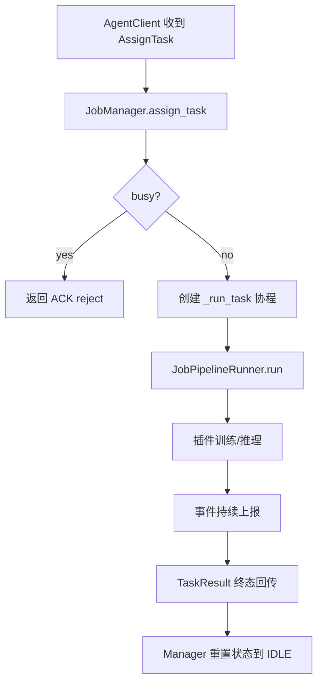

# Saki Executor Runtime 设计模式解析（任务执行端）

> 版本基线：`saki-executor/src/saki_executor` 当前实现（2026-02-12）
> 目标：回答“任务如何开始、策略如何注册、插件与本体如何分责”。

---

## 1. 执行器本质：一个“受控单工执行机”

`executor` 当前是单进程、单任务串行模型：

1. 通过 gRPC 长连接接收控制消息。
2. 每次最多执行一个 task。
3. 执行流程由本体编排，算法细节由插件提供。

这是一个典型“控制面在外、执行面在内”的代理节点。

---

## 2. 设计模式映射

## 2.1 状态机模式（State Machine）

代码位置：
- `jobs/state.py`

状态：
1. 执行器状态：`OFFLINE/CONNECTING/IDLE/RESERVED/RUNNING/FINALIZING/ERROR_RECOVERY`
2. 任务状态：`PENDING/DISPATCHING/RUNNING/RETRYING/SUCCEEDED/FAILED/CANCELLED/SKIPPED`

意义：
- 连接生命周期与任务生命周期分离。
- 外部心跳可观测当前状态。

---

## 2.2 模板方法 + 管道模式（Template + Pipeline）

代码位置：
- `jobs/orchestration/runner.py` `JobPipelineRunner.run`

标准管道：
1. `validate_request`
2. `resolve_plugin`
3. `prepare_workspace`
4. `emit_start_status`
5. `run_training_pipeline`
6. `collect_candidates`
7. `upload_artifacts`
8. `finalize_result`

价值：
- 执行顺序固定，错误处理统一。
- 每一步可替换或细化，不破坏整体框架。

---

## 2.3 插件模式（Plugin Architecture）

接口定义：`plugins/base.py -> ExecutorPlugin`

插件必须实现：
1. `validate_params`
2. `prepare_data`
3. `train`
4. `predict_unlabeled`（可选批处理版本）
5. `stop`

本体职责：
- 连接、协议、状态、缓存、数据网关、上传、事件回传。

插件职责：
- 训练/推理/选样算法。

---

## 2.4 策略模式（Strategy）

代码位置：
- `strategies/builtin.py`
- `plugins/builtin/yolo_det/predict_pipeline.py`

表现：
- `random_baseline/uncertainty/aug_iou/plugin_native` 等策略统一以 score 函数抽象。
- 插件可内建“原生策略”并通过统一接口输出候选。

---

## 2.5 适配器模式（Adapter）

代码位置：
- `agent/codec.py`

用途：
- 负责 proto 与 executor 内部 payload 的双向转换。
- 把 gRPC 细节从业务执行逻辑中隔离。

---

## 2.6 门面模式（Facade）

`JobManager` 充当执行门面：

对外只暴露：
1. `assign_task`
2. `stop_task`
3. `status_snapshot`
4. `set_transport`

内部再协调：
- `DataGateway`
- `SamplingService`
- `ArtifactUploader`
- `JobPipelineRunner`

---

## 2.7 观察者/事件流模式

本地事件：`sdk/reporter.py` 把事件写到 `events.jsonl`（带 seq）

远程事件：`JobManager._push_event -> runtime_codec.build_task_event_message`

形成“双通道可观测”：
1. 本地可回放
2. 服务端实时展示

---

## 3. 任务如何开始（模式视角）

重点：
- 接受任务时只做“保留资源 + 启动协程”，真实执行在 `_run_task`。
- 终态统一在 `_publish_*_result` / `_reset_after_task` 收敛。

---

## 4. 策略与插件注册机制

## 4.1 注册入口

- `main.py` 中 `registry = PluginRegistry(); registry.load_builtin()`
- `PluginRegistry.load_builtin()` 当前注册：`YoloDetectionPlugin` 与 `DemoDetectionPlugin`

## 4.2 对 API 的能力宣告

`AgentClient._register_message` 会把每个插件能力打包上报：
1. plugin_id/version/display_name
2. supported_task_types
3. supported_strategies
4. request_config_schema/default_request_config
5. supported_accelerators

API 侧据此做：
- 插件目录聚合
- loop model_arch 合法性校验

---

## 5. 插件与本体职责分配（你最关心的边界）

本体（必须统一）：
1. 协议收发与幂等 ACK
2. 执行状态机
3. 工作目录与事件序列
4. 训练数据拉取（DataGateway）
5. 样本缓存（AssetCache）
6. 制品上传（ArtifactUploader）
7. 候选样本 TopK 维护（SamplingService）

插件（可替换）：
1. 参数校验
2. 数据格式准备
3. 训练实现
4. 未标注样本打分
5. 任务停止细节

这条边界非常关键：
- 让新模型接入只改插件，不改控制链路。

---

## 6. 停止与异常模式

停止路径：
1. API 下发 `StopTask`
2. `JobManager.stop_task` 置 `_stop_event`
3. 调用插件 `stop(task_id)`（best effort）
4. 流程转 `CANCELLED` 回传

异常路径：
1. pipeline 抛异常 -> `_publish_failed_result`
2. 统一发失败状态与错误信息
3. manager 最终 `IDLE`，可接下一任务

---

## 7. 当前设计优点与问题

优点：
1. 本体与插件边界清晰。
2. 执行管道固定，可测试。
3. 事件/结果链路一致。

问题：
1. `JobManager` 仍较“全能类”，后续可进一步拆成 `TaskRunner + TaskContext + TaskLifecycle`。
2. 当前单任务串行，吞吐依赖横向扩 executor 实例。
3. payload 仍以 dict 在内部流转，DTO 化可继续推进。

---

## 8. 对你这种 Java 背景开发者的翻译

你可以把 executor 看成：

1. `AgentClient` = Netty channel + control protocol adapter
2. `JobManager` = Application Facade + Lifecycle coordinator
3. `JobPipelineRunner` = Template method use-case
4. `ExecutorPlugin` = SPI 扩展点
5. `DataGateway/ArtifactUploader/AssetCache` = Infrastructure adapters

即：模式并不缺失，只是表达更轻量、组合优先。

---

## 9. 一句话总结

`Saki-executor` 当前是“强控制、弱并发、插件可插拔”的运行时执行端：
- 适合快速迭代算法插件；
- 若后续要提升吞吐，优先在实例层扩容与任务分片，而不是先把单实例内部做复杂并发。
